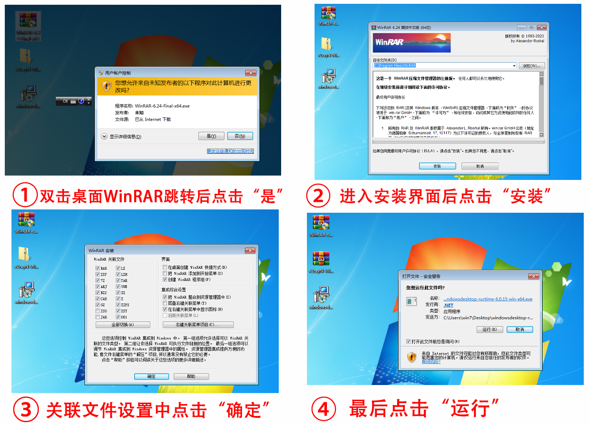
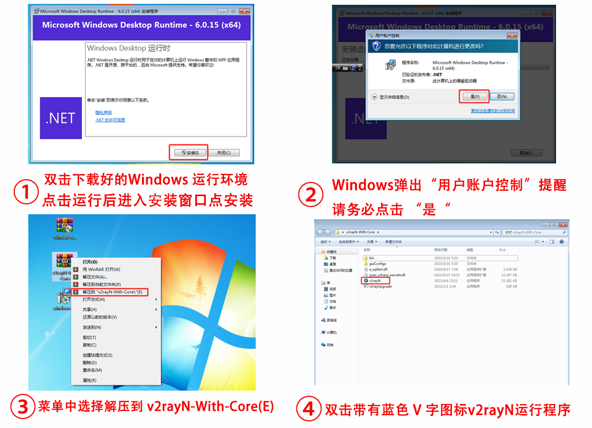
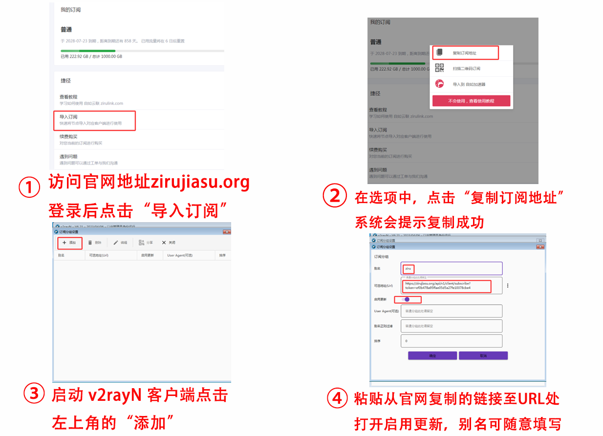
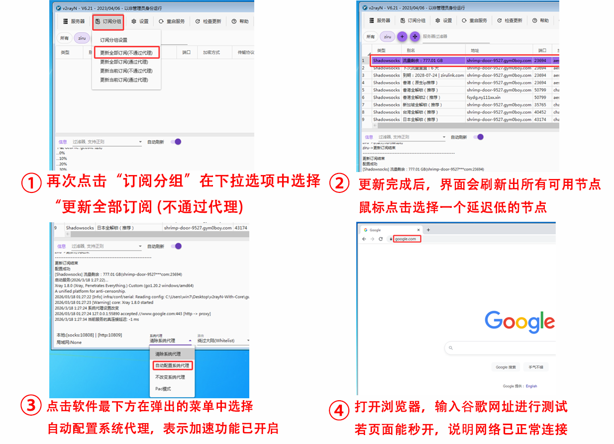

# Windows7-v2rayN-Tutorial
针对 Windows 7 系统的 v2rayN 客户端下载、环境部署及自如加速器订阅导入全流程图文指引。
# 💻 Windows 7 专用：v2rayN 客户端下载与订阅导入全攻略

本教程专为 **Windows 7** 老系统用户打造。由于 Win7 环境较特殊，请务必严格按照以下 **[环境部署]** 到 **[订阅激活]** 的流程操作，以确保网络优化服务稳定运行。

---

## 📌 准备工作（官方下载）

在开始安装前，请先下载以下三个必要组件：

1. **① 解压缩工具 (WinRAR)**：[点击下载 WinRAR-6.24-Final-x64.exe](https://app.zirulink.com/WinRAR-6.24-Final-x64.exe)
2. **② 运行环境 (Runtime)**：[点击下载 windowsdesktop-runtime-6.0.15-win-x64.exe](https://app.zirulink.com/windowsdesktop-runtime-6.0.15-win-x64.exe)
3. **③ 客户端核心包 (v2rayN)**：[点击下载 v2rayN-With-Core.zip](https://app.zirulink.com/v2rayN-With-Core.zip)

---

## 🛠️ 第一阶段：环境部署与软件解压

### ① 安装 WinRAR 与解压环境
1. **双击安装包**：运行 `WinRAR-6.24`，在系统弹窗中点击“是”。
2. **执行安装**：点击“安装”按钮，并在关联设置中点击“确定”。
3. **完成部署**：安装完成后，您的电脑即可正常识别 `.zip` 格式的压缩文件。

### ② 安装 .NET 6.0 运行环境
1. **启动向导**：双击运行 `windowsdesktop-runtime`，点击“安装”。
2. **权限放行**：弹出“用户账户控制”时，请务必点击**“是”**。
3. **软件运行**：环境安装好后，右键解压 `v2rayN-With-Core.zip`，进入文件夹双击蓝色 **V** 图标程序即可启动。

---

## 🚀 第二阶段：获取订阅与配置连接

### ③ 获取并添加订阅链接
1. **登录后台**：访问官方门户 [ziru.us](https://ziru.us)，登录后点击“导入订阅”。
2. **复制链接**：点击“复制订阅地址”，系统提示成功。
3. **客户端配置**：在 v2rayN 中点击“订阅分组” -> “添加”，粘贴链接并打开“启用更新”开关。

### ④ 更新节点并开启加速
1. **同步列表**：点击“订阅分组” -> “更新全部订阅 (不通过代理)”。
2. **选择节点**：在刷新的列表中选择一个延迟较低的节点，按下键盘 **Enter** 键确认。
3. **启动代理**：点击底部的“系统代理”，切换为**“自动配置系统代理”**。此时打开浏览器访问 `google.com` 即可享受极速连接。

---

---

### 🔗 技术支持与关联
* **GitHub 技术主页**：[点击访问](https://github.com/janhaas1980-south/janhaas1980-south)
* **性能监测白皮书**：[点击查看](https://www.babeedu.net/?p=760)
* **官方门户**：[ziru.us](https://ziru.us)
